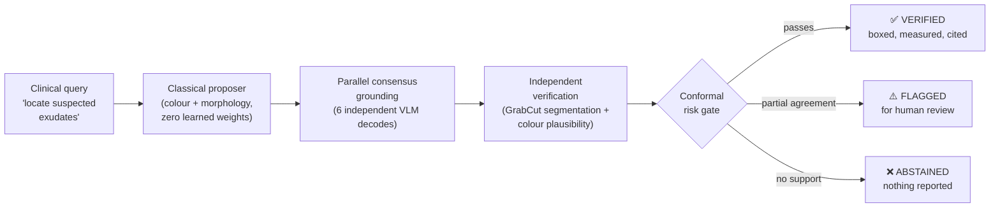
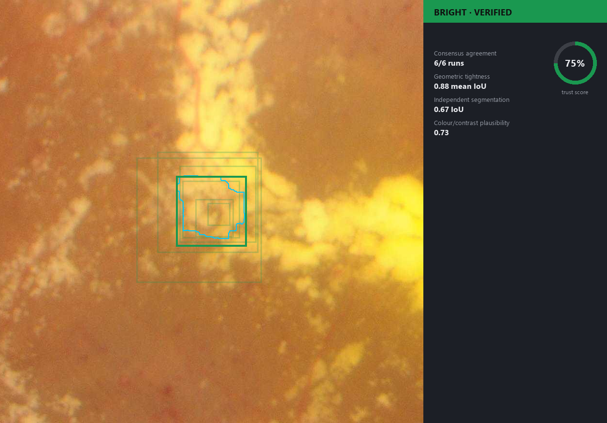
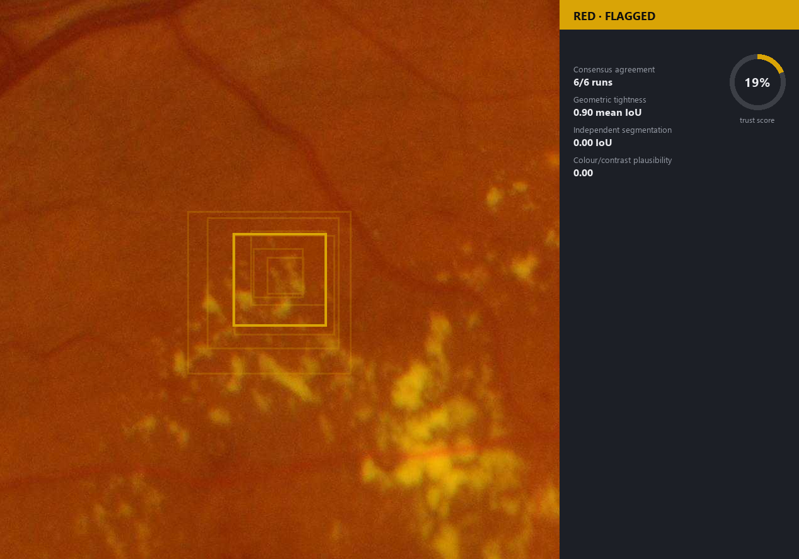
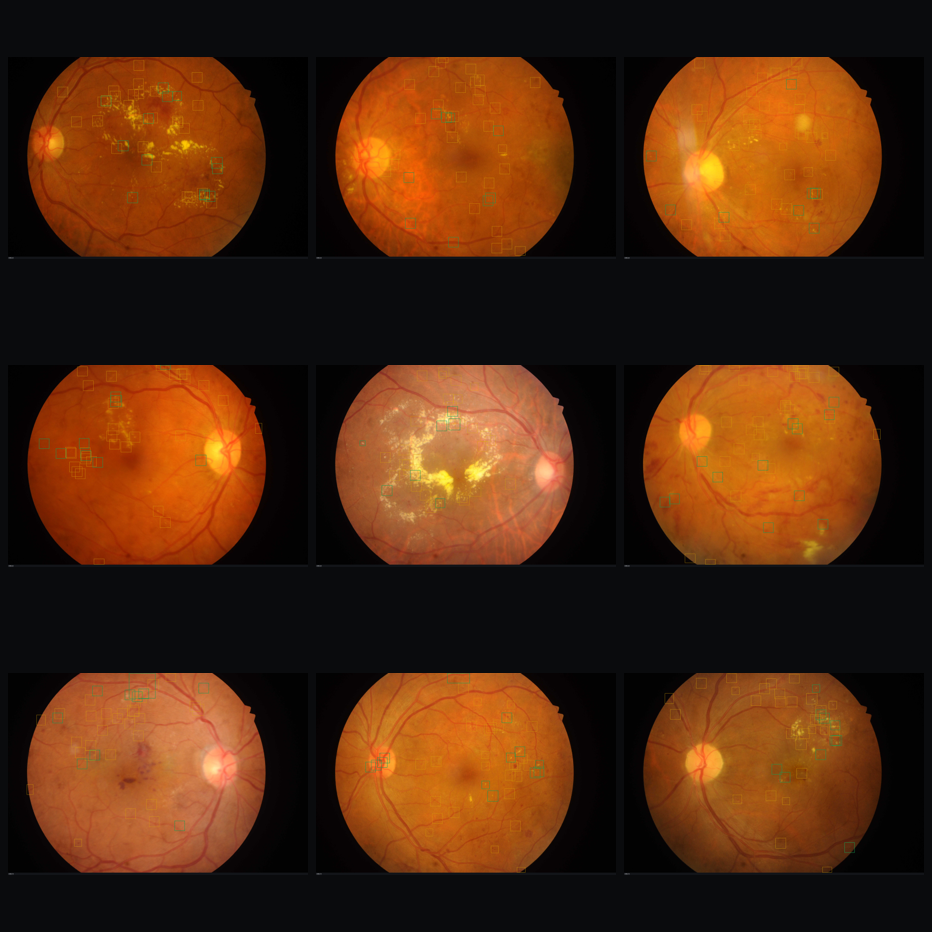
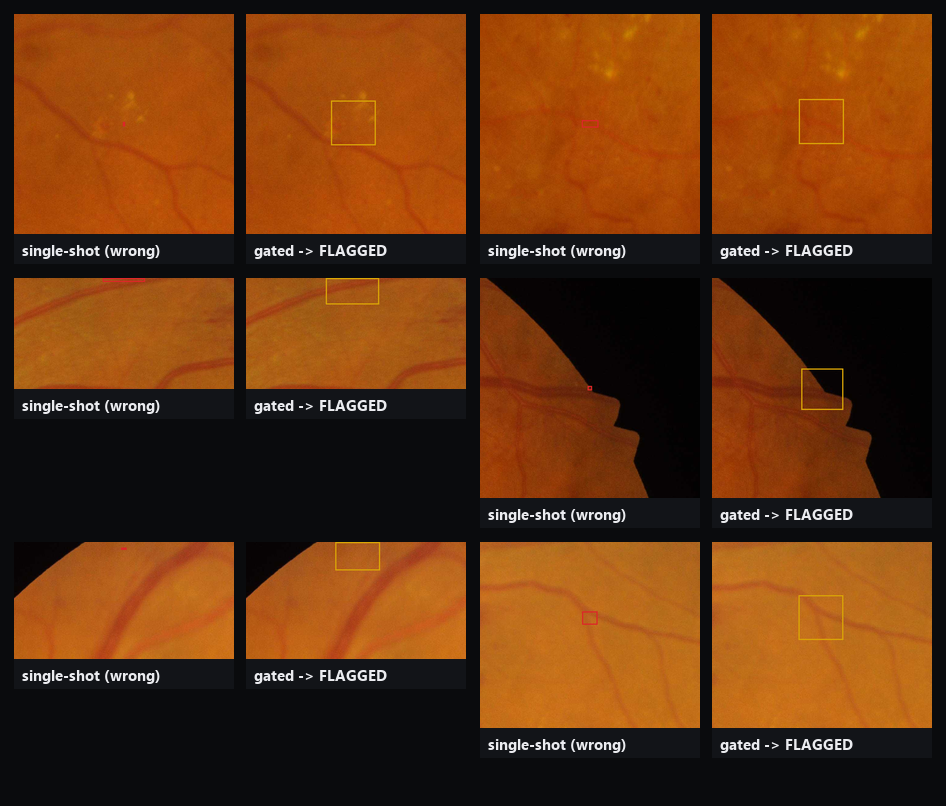

<div align="center">

# EvidenceGate

### A vision-language agent that would rather say nothing than guess.

*Consensus-gated, statistically calibrated grounding — built on the exact gap a LocateAnything (NVIDIA et al., 2026) author named as unsolved.*

[](LICENSE)
[](pyproject.toml)
[](docs/METHOD.md)
[](docs/METHOD.md)

</div>

---

## A box is one object. Is a diagnosis?

A recent grounding model, **LocateAnything**, made a simple observation: a bounding box's
four coordinates describe one geometric object, so a model shouldn't decode them as four
disconnected tokens — it should commit to the whole box at once. That single change bought
a large speedup and tighter boxes.

Its authors then pointed at something they hadn't built: a medical-image agent that
locates findings, calls in real segmentation and measurement tools, and answers with the
evidence attached — "not only capable, but traceable and verifiable." They called it a
useful direction. They didn't build it.

**EvidenceGate is that missing piece** — not a diagnosis model, but the layer that decides
*whether a grounding model's claim has earned the right to be reported at all.* Every
number below is measured, not assumed: calibrated on one half of a public retina dataset,
then checked against the other half, which never influenced the calibration.

<div align="center">

| | Ordinary grounding agent | EvidenceGate |
|---|---|---|
| Asks the model | once, deterministically | 6 times, under crop/scale/prompt jitter |
| A claim is | whatever came out | a cluster of agreeing, independently cross-checked evidence |
| Faced with weak evidence | reports it anyway | narrows the claim, or stays silent |
| The precision number | an unaudited point estimate | a number with a proof *and* a held-out measurement next to it |

</div>

---

## The promise, stated as a contract

A held-out calibration sweep (see [`docs/METHOD.md`](docs/METHOD.md)) asked a blunt question
first: *what precision can this evidence actually support?* An ambitious 90%-precision target
turned out to be **honestly uncertifiable** — the gate would rather admit that than fake it.
The certified target below is the real number the data supports.

<div align="center">

| Lesion family | Certified promise | Measured on held-out test | Verdict |
|---|---|---|---|
| 🟡 Bright (exudates) | ≥ 25% precision, 90% confidence | **36.4%** · 231 claims · 90% CI [31.1%, 41.9%] | ✅ contract held |
| 🔴 Red (microaneurysms/haemorrhages) | *no certifiable threshold found* | 0 claims reported | ⚪ correctly abstains |

</div>

Red-family evidence (classical proposer + zero-shot grounding + independent checks) never
separated correct from incorrect claims well enough to certify *any* precision floor —
not even a lenient one. Rather than invent a number, the gate reports nothing for that
family at all. That refusal is not a bug in the demo; it is the entire thesis, working.

---

## The five-stage agent



This is the five-step agent the source post sketched — interpret, locate, extract, verify,
answer-with-evidence — with a calibrated statistical gate in front of the answer instead of
a raw model score.

---

## Walk one finding through the gate

<div align="center">

</div>

Every faint box in the glow is one of the 6 independent decodes the grounder produced under
crop jitter, scale jitter, and prompt paraphrase. A tight, bright cluster means the model
keeps landing in the same place no matter how you ask it — that agreement, plus an
independent segmentation and a colour/contrast check that never saw the grounder's answer,
is what a single-shot call throws away.

Consensus alone is not enough to trust, though — here is a claim the model agreed on
**every single time**, and the gate still would not verify it:

<div align="center">

</div>

6/6 runs agree on the location. Independent segmentation and colour plausibility both come
back at zero. The gate flags it for review instead of reporting it as fact — perfect
self-agreement is not evidence if nothing independent backs it up.

---

## What got through, what got caught

<div align="center">

</div>

Green boxes are Verified — calibrated, held-out-validated claims. Amber boxes are Flagged —
real agreement, insufficient independent corroboration, routed to a human. Nothing else is
drawn: on this family (bright lesions) the gate has something to say. On red lesions, per
the contract above, it mostly has nothing to say at all.

### Where a naive single-shot call gets it wrong

<div align="center">

</div>

Same candidate region, same zero-shot model. Left: one deterministic grounding call, reported
as fact — wrong, on every example shown. Right: the consensus-gated agent's answer to the
identical region — flagged for review rather than asserted.

---

## Does the contract hold?

Calibrated on IDRiD's official **training** split (54 images). Everything below is measured
on IDRiD's official **testing** split (27 images) — data the gate never touched during
calibration.

<div align="center">

| Metric (bright lesions) | Value |
|---|---|
| Certified precision floor | ≥ 25% (90% confidence) |
| **Measured precision, held-out test** | **36.4%** (84 / 231) |
| 90% confidence interval | [31.1%, 41.9%] |
| Recall of true lesion instances | 15.5% (645 / 4,152) |
| Contract held? | ✅ yes — measured precision clears the certified floor |

</div>

A fair question: how does this compare to just asking the same zero-shot model once, with no
gate at all?

<div align="center">

| | Naive single-shot (no gate, no guarantee) | EvidenceGate Verified tier |
|---|---|---|
| Bright precision | 46.1% (249 / 540) | 36.4% [31.1%, 41.9%] |
| Red precision | 29.3% (158 / 540) | *abstains — 0 claims* |
| Claims reported | every candidate, always | only what clears a proven bound |
| What backs the number | nothing | a calibration procedure, checked on unseen data |

</div>

The naive baseline's raw number is *higher* on bright lesions in this run. That is reported
here on purpose, not hidden: **an unaudited point estimate and a certified floor are
different things**, and this project's contribution is the second one. 46.1% on this
particular test set carries no guarantee it will be 46.1% on the next batch of images; 25%
does, at 90% confidence, by construction. On red lesions the difference is stark either way
— the naive approach confidently reports 540 guesses (71% of them wrong), while the gate
recognizes the evidence doesn't support a floor and reports nothing.

---

## Peeling back each signal

Four evidence signals feed the gate. What does each one actually buy, measured the same way
as everything above (recalibrated on train, measured on test)?

<div align="center">

| Configuration (bright lesions) | Claims accepted | Measured precision | Measured recall |
|---|---|---|---|
| Consensus signals alone | 1 *(degenerate)* | — | ~0% |
| Consensus + independent segmentation | 0 *(uncertifiable)* | — | 0% |
| Consensus + colour/contrast plausibility | 288 | 35.8% | 19.3% |
| **Full gate** (reweighted toward what works) | **231** | **36.4%** | **15.5%** |

</div>

Two honest findings came out of this, not the one originally expected:

- **Cross-run agreement alone is nearly worthless here.** This zero-shot backbone grounds
  *something* in almost every crop it's given, whether or not the something is real — asking
  it 6 times and finding agreement mostly measures its determinism, not its correctness. The
  deployed weights reflect this (10% each, down from an initial 35%/20% equal split).
- **Colour/contrast plausibility does most of the real work**; independent segmentation adds
  precision holding roughly steady while trading away some recall, rather than being the
  dominant signal originally expected of a dedicated "verification tool." Both findings are
  visible directly in the table, not asserted.

---

## Where the gate is honest about failing

- **Weak-to-moderate discriminative signal, not a strong one.** The evidence sources here
  separate correct from incorrect claims well enough to certify a real, held-out-validated
  25% floor for bright lesions — not well enough for anything close to 90%. That ceiling
  belongs to the zero-shot backbone and classical CV signals used, not to the calibration
  procedure itself (see the ablation above).
- **A calibrated floor can undershoot an unaudited baseline's point estimate on a given run**
  — see "Does the contract hold?" above. The value of calibration is the guarantee, not a
  promise of the highest number in the room.
- **Small calibration/test sets.** 54 calibration images, 27 test images, from IDRiD's
  official split. Enough to demonstrate the procedure and get an honest answer; not enough
  for a population-level clinical claim. Every measured rate above ships with a confidence
  interval for exactly this reason.
- **Claim-level, not image-level, independence.** Claims from the same fundus photo share
  illumination, camera, and patient — not truly exchangeable with each other. The guarantee
  is evaluated at the claim level, standard practice in the conformal-prediction-for-detection
  literature, but worth naming rather than burying.
- **A zero-shot ceiling.** Florence-2 has never seen a retina. The gate raises the confidence
  you can place in what a general-purpose grounder reports; it cannot manufacture recall the
  base model never had.
- **Not a diagnostic device.** A research artifact demonstrating a trust-calibration
  mechanism against public segmentation ground truth. No clinical validation, no diagnostic
  claim, anywhere.

Full derivation, the exact statistical guarantee, and related-work positioning:
[`docs/METHOD.md`](docs/METHOD.md).

---

## Running it

```bash
python -m venv .venv && .venv/Scripts/activate   # or source .venv/bin/activate
pip install -e ".[dev]"
pip install torch --index-url https://download.pytorch.org/whl/cu130   # match your CUDA version

python scripts/download_data.py            # pulls IDRiD's segmentation subset (~584 MB, CC BY 4.0)
python scripts/run_calibration.py          # calibrates the gate on the train split
python scripts/run_pipeline.py             # runs the calibrated agent on the held-out test split
python scripts/run_baseline_comparison.py  # naive single-shot baseline, for comparison
python scripts/run_ablation.py             # signal-ablation sweep
python scripts/make_figures.py             # renders everything under assets/

pytest tests/                              # 22 tests: geometry, consensus clustering, risk control, proposers
```

Runs end-to-end on a single consumer GPU (developed and measured on an 8GB laptop GPU) — no
training, no cluster, no proprietary data.

---

## Repository map

```
src/evidencegate/
  proposers/       classical, zero-learned-weight candidate detectors
  grounding/        Florence-2 wrapper, prompt bank, perturbation sampler
  consensus/         union-find clustering (IoU + scale-robust center distance) over K decodes
  verification/       independent GrabCut segmentation + colour plausibility
  calibration/         nonconformity scoring + Bonferroni-corrected risk control
  report/              evidence cards, galleries, trust-ring SVGs
  pipeline.py          the agent itself
scripts/                one script per pipeline stage (see Running it)
docs/METHOD.md          the full method write-up: algorithm, guarantee, honest limitations
assets/                 every figure and result in this README, plus more not shown here
```

---

## Lineage

- Wang, S. et al. *LocateAnything: Fast and High-Quality Vision-Language Grounding with
  Parallel Box Decoding.* arXiv:2605.27365, 2026 — the paper this project responds to.
- Angelopoulos, Bates, Candès, Jordan & Lei. *Learn then Test: Calibrating Predictive
  Algorithms to Achieve Risk Control.* arXiv:2110.01052, 2021 — the calibration framework.
- Porwal et al. *Indian Diabetic Retinopathy Image Dataset (IDRiD).* Data, 3(3), 25, 2018.
  CC BY 4.0 — the dataset every number in this README is measured against.
- Xiao et al. *Florence-2.* CVPR, 2024 — the zero-shot grounding backbone, used unmodified.

